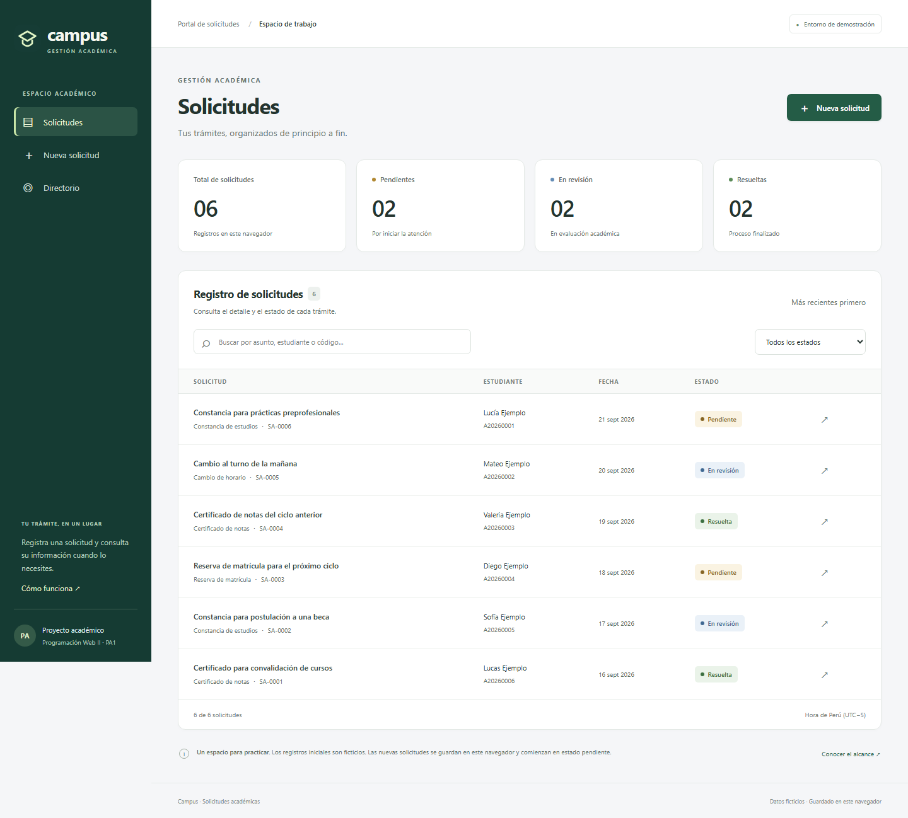

# Campus · Plataforma de Gestión de Solicitudes Académicas

**Curso:** Programación Web II · Código 30690<br>
**Evaluación:** PA1 · Sesiones 1 a 4 · Periodo 202620<br>
**Sección:** 3677.202620<br>
**Docente:** ESPINOZA BRAVO, WILDER JULIO<br>
**Estudiante:** Angel Fernando Reyes Moreno<br>
**Repositorio:** [PA1-PROGRAMACI-N-WEB-AVANZADA-](https://github.com/75729271-dev/PA1-PROGRAMACI-N-WEB-AVANZADA-)

## 1. Integrante

| Nombre completo | Responsabilidad | Participación |
|---|---|---|
| Angel Fernando Reyes Moreno | Presentación individual y revisión de la entrega | Selección de recursos visuales, revisión de la interfaz y entrega del video. Ver [registro de participación](docs/PARTICIPACION.md). |

## 2. Descripción y objetivo

**Problema.** Las solicitudes académicas necesitan datos consistentes, una forma clara de registro y vistas organizadas para consultarlas. Concentrar las reglas, el acceso a datos y la presentación en un solo componente dificulta mantener la aplicación.

**Objetivo.** Construir un frontend en Angular 16 con TypeScript estricto que permita registrar solicitudes válidas, navegar a su detalle, consultarlas por búsqueda y estado, y visualizar datos de una API REST mediante `HttpClient`.

**Solución.** Campus ofrece un listado con indicadores, un formulario reactivo, una vista de detalle, un directorio remoto y una guía de uso. Los registros académicos se guardan en `localStorage`; el directorio consulta usuarios ficticios de JSONPlaceholder. Ambas fuentes se identifican por separado.



Las imágenes proporcionadas se integran en el encabezado, el formulario y los estados vacíos. [Uso de los recursos visuales](docs/RECURSOS-VISUALES.md).

### Alcance

- Registro, consulta, búsqueda, filtros y persistencia local de solicitudes.
- Seis solicitudes ficticias iniciales para mostrar diferentes estados. Los nuevos registros comienzan en **Pendiente**.
- Directorio REST real, independiente del registro académico. Fuente usada en la sesión 4, diapositiva 30.
- Sin autenticación, envío de correos, atención administrativa, base de datos central ni backend Node.js. El caso de PA1 no exige esas implementaciones.
- Las reglas del código `A` + 8 dígitos y las longitudes del formulario son decisiones de este caso de demostración, no políticas oficiales de ISIL.

## 3. Desarrollo y solución de las cuatro actividades

| Actividad | Implementación concreta | Código principal | Evidencia |
|---|---|---|---|
| 1. Base tipada y modular | Interfaces `Estudiante`, `NuevaSolicitud`, `Solicitud`, `UsuarioApi`; uniones para tipos y estados; ES6+; módulos ES; compilación estricta | [Modelos](src/app/core/models/solicitud.model.ts), [utilidades](src/app/core/utils/solicitud.utils.ts), [configuración TS](tsconfig.json) | [Comprobación de tipos](evidencias/tipado.txt) y [compilación](evidencias/compilacion.txt) |
| 2. Arquitectura Angular | `AppModule`, módulo de solicitudes con carga diferida, `SharedModule`, componentes separados, servicio compartido e inyección por constructor | [Módulo de solicitudes](src/app/features/solicitudes/solicitudes.module.ts), [servicio](src/app/core/services/solicitudes.service.ts) | Listado, contadores, búsqueda, detalle y pruebas 01, 02, 05, 06 |
| 3. Formulario y rutas | Formulario reactivo tipado, validadores, errores por campo, `RouterModule.forRoot` y `forChild`, ruta de detalle y 404 | [Formulario](src/app/features/solicitudes/nueva-solicitud.component.ts), [rutas](src/app/app-routing.module.ts) | Capturas de [datos inválidos](evidencias/capturas/02-validaciones.png) y [registro válido](evidencias/capturas/03-registro-exitoso.png) |
| 4. API REST | `HttpClient` dentro de un servicio inyectable, validación de respuesta, carga, error, reintento y vista de usuarios | [Servicio HTTP](src/app/core/services/directorio.service.ts), [vista del directorio](src/app/features/directorio/directorio.component.ts) | [Captura real](evidencias/capturas/04-api-real.png) y [registro HTTP real](evidencias/consumo-api-real.json) |

### Procedimiento seguido

1. Leer la consigna, identificar los cuatro productos técnicos y contrastarlos con las sesiones y la rúbrica.
2. Fijar Angular 16.2.12, CLI 16.2.16 y TypeScript 5.1.6. Configurar el proyecto y su compilación.
3. Definir modelos, reglas y ejemplos ficticios antes de conectar las vistas.
4. Separar el almacenamiento de solicitudes y la consulta HTTP en servicios independientes.
5. Implementar listado, resumen, filtros, formulario, detalle y navegación.
6. Agregar validación real del JSON remoto, estados de carga, errores, reintento y control del almacenamiento local.
7. Compilar, ejecutar las pruebas en navegador, revisar las capturas y documentar resultados y límites.

### Relación con lo visto en clase

| Sesión | Aplicación en este proyecto |
|---|---|
| 1 | `const`, `let`, funciones flecha, destructuración, spread, template literals, interfaces, uniones e importación/exportación. `async/await` en `DirectorioComponent.cargar()`. |
| 2 | Componentes y servicios tipados; `strict`, `sourceMap` y `strictTemplates`; empaquetado Webpack gestionado por Angular CLI. Se utiliza Angular como exige el caso; la mención de React en el temario no obliga a construir otra aplicación. |
| 3 | `NgModule`, componentes, interpolación, `[disabled]`, `[estado]`, `(click)`, `(ngSubmit)`, `[(ngModel)]` en filtros, `*ngIf`, `*ngFor`, `[ngClass]`, `@Input` y servicios con DI. |
| 4 | `ReactiveFormsModule`, `FormBuilder`, `Validators`, validador personalizado, `RouterModule`, `HttpClientModule`, servicio REST y explicación de una futura integración con backend. |

**Decisiones importantes.** Los módulos ES organizan los archivos TypeScript; los `NgModule` organizan Angular. No se agregan namespaces globales redundantes. El builder `@angular-devkit/build-angular:browser` administra Webpack, por lo que no se duplica su configuración con un `webpack.config.js` manual. [Arquitectura y justificación completa](docs/ARQUITECTURA.md).

## 4. Cómo ejecutar o revisar

### Requisitos

- Node.js **18.20.8** y npm **10.x** para reproducir este proyecto académico Angular 16.
- Git y un navegador moderno.
- Internet para instalar dependencias y consultar el directorio.

Angular 16.2 requiere Node `^16.14.0` o `^18.10.0` y TypeScript `>=4.9.3 <5.2.0`, según la [tabla oficial](https://angular.dev/reference/versions). Se fija Node 18 en `.nvmrc`. Estas versiones históricas se conservan por el requisito académico; no son una recomendación para un sistema nuevo de producción. No actualizar Angular automáticamente durante la revisión.

```bash
git clone https://github.com/75729271-dev/PA1-PROGRAMACI-N-WEB-AVANZADA-.git
cd PA1-PROGRAMACI-N-WEB-AVANZADA-
node --version
npm --version
npm ci
npm start
```

Abrir **http://127.0.0.1:4200**. En Windows, si PowerShell bloquea `npm.ps1`, usar `npm.cmd` en los mismos comandos.

**En la computadora donde se preparó este trabajo:** existe un entorno Node 18 local en `.tools/`, excluido de Git. Para iniciarlo sin cambiar Node del sistema:

```powershell
powershell -ExecutionPolicy Bypass -File scripts/iniciar-local.ps1
```

Ese script utiliza las herramientas ya instaladas. En otro equipo seguir `npm ci` y `npm start` con Node 18.

### Compilación y pruebas

```bash
npm run typecheck
npm run build
npx playwright install chromium
npm test
```

La compilación genera `dist/campus/`. `npm test` inicia el servidor si no existe uno, ejecuta pruebas y guarda resultados/capturas. La prueba marcada **API REAL** necesita que JSONPlaceholder sea accesible. El resto utiliza respuestas HTTP controladas para comprobar errores de forma repetible:

```bash
# Solo pruebas independientes de la disponibilidad externa
npm test -- --grep-invert "API REAL"

# Solo la evidencia de consumo real
npm test -- --grep "API REAL"

# Informe visual de la última ejecución
npx playwright show-report
```

El flujo de GitHub Actions ejecuta compilación y pruebas deterministas. No presenta respuestas simuladas como evidencia de consumo real.

### Recorrido de revisión

1. Abrir `/solicitudes`: comprobar seis ejemplos y los contadores. Buscar `lucia` y filtrar por estado.
2. Abrir `/solicitudes/nueva`, pulsar **Registrar solicitud** sin datos: aparecen seis errores y no se registra nada.
3. Probar correo `correo@`, código `123`, asunto corto o descripción con espacios: el formulario impide el registro.
4. Completar con `Andrea Ejemplo`, `A20261234`, `andrea@example.com`, un tipo, asunto de al menos 5 caracteres y descripción de al menos 20.
5. Registrar: comprobar confirmación, código único y estado pendiente. Regresar al listado y recargar: debe conservarse el nuevo registro.
6. Abrir `/directorio`: comprobar contactos, origen HTTP y respuesta **HTTP 200**. En DevTools → Network filtrar `users` y mostrar la respuesta JSON.
7. Para demostrar error real de conexión, cambiar Network a Offline y pulsar **Actualizar directorio**. Volver a Online y pulsar **Reintentar**.
8. Abrir una URL inexistente y un código de solicitud inexistente: se muestran mensajes adecuados.

**Restablecer la demo:** desde DevTools → Application → Local Storage eliminar solamente `campus.solicitudes.v1` y recargar. Esto borra los registros locales del portal. No borrar otros datos del navegador. Las pruebas usan contextos aislados y no modifican las solicitudes de tu sesión personal.

## 5. Evidencias

Las capturas proceden de la aplicación en ejecución con datos ficticios. Los resultados se encuentran en [evidencias](evidencias/README.md).

| Archivo | Qué demuestra |
|---|---|
| [01 · Solicitudes](evidencias/capturas/01-solicitudes.png) | Componentes, indicadores, directivas y listado |
| [02 · Validaciones](evidencias/capturas/02-validaciones.png) | Formulario inválido y mensajes por campo |
| [03 · Registro correcto](evidencias/capturas/03-registro-exitoso.png) | Registro válido, persistencia y navegación al detalle |
| [04 · API real](evidencias/capturas/04-api-real.png) | Usuarios obtenidos mediante una petición real |
| [05 · Error HTTP simulado](evidencias/capturas/05-error-api-simulado.png) | Estado de error 503 inducido exclusivamente por la prueba |
| [06 · Móvil](evidencias/capturas/06-movil.png) | Diseño adaptable y navegación en pantalla pequeña |
| [Evidencia HTTP](evidencias/consumo-api-real.json) | URL, método, estado, fecha y cantidad de usuarios de la consulta real |
| [Tipado](evidencias/tipado.txt), [build](evidencias/compilacion.txt), [pruebas](evidencias/pruebas.txt) | Resultados verificables de las herramientas |

## 6. Matriz de participación

| Integrante | Desarrollo | Pruebas | Documentación | Exposición | Evidencia individual |
|---|---|---|---|---|---|
| Angel Fernando Reyes Moreno | Selección de imágenes y solicitud de ajustes de marca y textos | Resultados automáticos en evidencias; seguimiento de clase por documentar | Datos de entrega, revisión del contenido y enlace del video | [Video de exposición](https://www.youtube.com/watch?v=TKgLy1HdxAg) | [Registro individual](docs/PARTICIPACION.md) |

No se asignan niveles de participación ni asistencia sin evidencia. Completar la [bitácora individual](docs/PARTICIPACION.md) con fechas reales, avances, revisiones y retroalimentación. Los commits y las pruebas automáticas de esta preparación no sustituyen la asistencia evaluada por el docente.

## 7. Video de exposición

**Video de exposición en YouTube:** [Ver la exposición de Campus](https://www.youtube.com/watch?v=TKgLy1HdxAg)

El enlace fue proporcionado por el estudiante. La configuración de visibilidad debe permanecer en **Público** para cumplir la consigna.

Material de apoyo: [presentación PowerPoint](output/exposicion/Campus-PA1-Presentacion-final.pptx), [guion corrido en PDF](output/pdf/Campus-Guion-Corrido-10-Minutos.pdf) y [guion editable](docs/GUION-CORRIDO-10-MINUTOS.md). La exposición debe incluir cámara encendida, procedimiento, decisiones, código y demostración.

## 8. Conclusiones

1. Las interfaces y uniones permiten describir las entidades y restringir sus estados antes de ejecutar. La validación del JSON complementa el tipado estático cuando los datos provienen de una fuente externa.
2. Separar componentes, módulos y servicios permite compartir el registro entre vistas sin duplicar lógica. El formulario y el listado consumen el mismo servicio inyectado.
3. El formulario reactivo impide guardar datos incompletos y comunica qué corregir. Las rutas permiten pasar del registro al detalle y regresar al listado conservando los datos.
4. `HttpClient` permite consumir una API sin implementar el backend de las sesiones posteriores. Los estados de carga, error y reintento hacen visible el resultado de la comunicación.
5. La persistencia local es suficiente para demostrar el caso de PA1, pero no reemplaza una base de datos multiusuario. Una etapa posterior requeriría backend, autenticación y validación del lado del servidor.

## 9. Rúbrica y pendientes de entrega

| Criterio de la tabla oficial | Máximo | Dónde se atiende |
|---|---:|---|
| Tipado, ES6+ y módulos | 3 | Actividad 1 |
| Componentes, binding, directivas y servicios | 3 | Actividad 2 |
| Formulario reactivo y RouterModule | 2 | Actividad 3 |
| API REST con HttpClient | 2 | Actividad 4 |
| GitHub y README | 4 | Este repositorio y documentación |
| Video público | 3 | Enlace incorporado en la sección 7; revisar visibilidad y contenido |
| Asistencia, participación y seguimiento | 3 | Evidencias individuales de clase |
| **Total** | **20** | La calificación corresponde al docente |

**Inconsistencia detectada:** la sección E del PDF menciona 12 puntos técnicos, pero su tabla H asigna 3 + 3 + 2 + 2 = **10**, y los otros criterios suman 10. Se conserva la tabla oficial que totaliza 20 y se recomienda consultar la discrepancia al docente. No se garantiza una nota.

- [x] Modalidad individual autorizada por el docente, según confirmación del estudiante.
- [ ] Revisar el código y realizar una ejecución personal completa.
- [ ] Registrar aportes y evidencias reales de seguimiento de sesiones 1 a 4.
- [x] Incorporar el enlace de la exposición proporcionado por el estudiante.
- [ ] Confirmar visibilidad Pública, cámara encendida y contenido del video.
- [x] Colocar el enlace de YouTube dentro del README.
- [x] Repositorio publicado y README accesible sin iniciar sesión.
- [ ] Entregar el enlace del repositorio en el aula virtual.

Ver el [checklist y los puntos delicados de la consigna](docs/ENTREGA.md).

## 10. Fuentes

- Material proporcionado: `PA1_30690_PROGRAMACION_WEB_II (1).pdf`, apartados E a H; plantilla de `README.md` del curso.
- Sesión 1: `30690-S01-PPT.pptx`, ES6+, tipos, interfaces y módulos.
- Sesión 2: `30690-S02-PPT.pptx`, componentes/servicios, TSConfig, Webpack y depuración.
- Sesión 3: `30690-S03-PPT.pptx`, módulos, componentes, binding y DI.
- Sesión 4: `30690-S04-PPT.pptx`, formularios, rutas y HttpClient; diapositiva 30 para JSONPlaceholder.
- [Compatibilidad de versiones Angular](https://angular.dev/reference/versions).
- [La sintaxis de control de flujo aparece desde Angular 17](https://angular.dev/reference/migrations/control-flow). Para Angular 16 se utilizan `*ngIf` y `*ngFor`.
- [Guía de JSONPlaceholder](https://jsonplaceholder.typicode.com/guide/).

**Última actualización:** 22/09/2026, hora de Perú. Las evidencias automáticas registran también fecha UTC.
