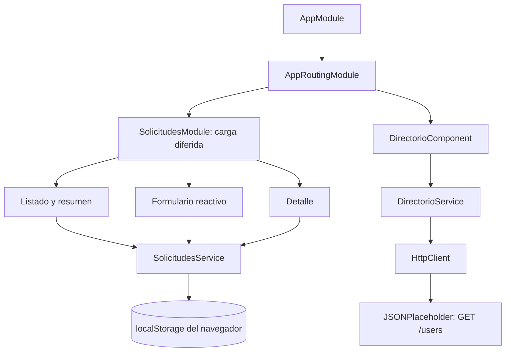

# Arquitectura y decisiones técnicas

## Organización

```text
src/app/
  core/
    models/           Contratos del dominio y del directorio externo
    data/             Seis solicitudes ficticias iniciales
    utils/            Reglas puras, normalización y resumen
    services/         Persistencia local y comunicación HTTP
  features/
    solicitudes/      Listado, formulario, detalle y NgModule
    directorio/       Vista de la API y estados de consulta
    ayuda/            Guía y página 404
  shared/             Componente de estado reutilizable y SharedModule
  app.module.ts       Módulo raíz
  app-routing.module.ts
```



## Actividad 1: datos y ES6+

`NuevaSolicitud` describe la entrada del formulario. `Solicitud` la extiende con `id`, `estado` y `creadaEn`, que asigna el servicio. Separar ambos contratos evita que la vista invente un identificador o un estado inicial. `Estudiante` agrupa los datos del solicitante. `TipoSolicitud` y `EstadoSolicitud` son uniones obtenidas de listas constantes con `as const`.

La aplicación utiliza `const` para referencias estables y `let` para contadores que cambian en `resumir()`. Usa funciones flecha para buscar, filtrar y transformar; destructuración para leer entidades; spread para crear nuevos objetos; y template literals para identificadores y mensajes.

`DirectorioComponent.cargar()` emplea `async/await` con `firstValueFrom`: espera una única respuesta de un Observable de `HttpClient`, captura fallos y finaliza el indicador de carga. `takeUntil` cancela la suscripción al abandonar la vista. El listado utiliza el pipe `async`, que gestiona su propia suscripción.

### Módulos y namespaces

Un archivo con `import`/`export` es un módulo ES que encapsula contratos y lógica. Un namespace TypeScript agrupa símbolos bajo un nombre, una técnica útil para contextos heredados o scripts globales. No se necesita envolver estos módulos en namespaces: añadirlos aquí sería redundante. `NgModule` es otro concepto: declara y relaciona las piezas de Angular.

## Actividad 2: responsabilidades y binding

`AppComponent` contiene la estructura de navegación. Las vistas tienen responsabilidades concretas. `SolicitudesService` es singleton con `providedIn: 'root'`; Angular inyecta la misma instancia a listado, formulario y detalle. Un `BehaviorSubject` privado conserva el estado y expone solamente un Observable.

| Mecanismo | Ejemplo verificable |
|---|---|
| Interpolación | `{{ solicitud.asunto }}`, contadores y fecha |
| Property binding | `[disabled]="guardando"` y `[estado]="solicitud.estado"` |
| Event binding | `(click)="limpiar()"`, `(ngSubmit)="guardar()"` |
| Binding bidireccional | `[(ngModel)]="busqueda"` en el filtro independiente |
| Directivas estructurales | `*ngIf` para estados y `*ngFor` para registros |
| Directiva de atributo | `[ngClass]` en `StatusBadgeComponent` |
| Comunicación padre-hijo | `@Input` tipado del componente de estado |

No se mezcla `ngModel` con controles del formulario reactivo. Los filtros son controles simples separados.

## Actividad 3: validación y navegación

| Campo | Regla del caso |
|---|---|
| Nombre | Obligatorio, 3 a 80 caracteres útiles |
| Código | Obligatorio, `A` mayúscula y 8 dígitos |
| Correo | Obligatorio, formato con dominio y extensión, máximo 120 caracteres |
| Tipo | Una de las cuatro opciones definidas |
| Asunto | Obligatorio, 5 a 100 caracteres útiles |
| Descripción | Obligatoria, 20 a 1000 caracteres útiles |

`FormBuilder.nonNullable` evita controles de texto con valores nulos. `longitudUtil()` comprueba el contenido después de `trim()`: introducir espacios no satisface los mínimos. El envío ejecuta `markAllAsTouched()` y retorna si el formulario es inválido. El botón se mantiene disponible en estado inválido para que el primer intento revele todos los errores; se desactiva mientras guarda para evitar duplicados. El servicio vuelve a validar las reglas antes de persistir.

`RouterModule.forRoot` define rutas globales. `RouterModule.forChild` organiza la funcionalidad de solicitudes. La ruta `nueva` se declara antes de `:id` para evitar que Angular interprete “nueva” como identificador. El detalle lee `paramMap`, busca el registro y muestra un estado de no encontrado cuando corresponde. La ruta comodín global presenta una página 404.

## Actividad 4: consumo REST verificable

Fuente: `https://jsonplaceholder.typicode.com/users`, usada en la sesión 4, diapositiva 30, y en la sesión 2. Se consulta con GET; no se envían los datos de las solicitudes académicas a ese servicio.

`DirectorioService` inyecta `HttpClient`, realiza la petición y devuelve un Observable tipado. `observe: 'response'` permite registrar el estado HTTP real. Se aplica un límite de espera de 12 segundos. La respuesta entra como `unknown` y el guard `esUsuarioApi()` valida los campos utilizados por la vista. Escribir `get<UsuarioApi[]>()` por sí solo no comprobaría el contenido recibido en ejecución.

La vista muestra carga, respuesta válida, lista vacía, error de formato, error de red y error HTTP. Actualizar o reintentar produce otra petición. No hay fallback de datos locales que pueda confundirse con una respuesta remota exitosa.

## Almacenamiento y límites

La clave `campus.solicitudes.v1` guarda una estructura `{version: 1, solicitudes: [...]}`. Al leer se verifica el formato, las entidades y la ausencia de IDs duplicados. Si los datos están corruptos, la aplicación informa el problema y presenta una lista vacía. No se elimina el almacenamiento automáticamente. Al guardar una nueva solicitud se intenta escribir una nueva lista y se informa si falla.

El servicio escribe antes de actualizar su estado observable. Así, si el navegador bloquea el almacenamiento o agota su cuota, el formulario conserva los datos y muestra error sin anunciar un éxito falso.

Se usa `crypto.randomUUID()` para IDs y `Date.toISOString()` para guardar fechas. Las vistas muestran hora de Perú (UTC−5). Los ejemplos iniciales tienen fechas fijas para que la demostración sea repetible.

No existe sincronización multiusuario ni resolución de ediciones simultáneas entre pestañas. Una sesión abierta podría conservar su copia en memoria si otra pestaña cambia el almacenamiento; por ello, la revisión del registro se plantea desde una sola pestaña. El registro es local al origen: `localhost` y `127.0.0.1` mantienen almacenamientos distintos. Los datos de demostración son ficticios y el sistema no incluye protección para almacenar información sensible.

## Sesión 2: TSConfig, Webpack y depuración

`strict: true` activa comprobaciones estrictas de TypeScript y `strictTemplates: true` aplica comprobaciones a las plantillas Angular. `sourceMap: true` permite inspeccionar TypeScript durante el desarrollo. La configuración de producción optimiza y genera nombres con hash.

Se utiliza el builder Webpack de Angular CLI 16, `@angular-devkit/build-angular:browser`. El CLI ya integra la compilación Angular, TypeScript y CSS. La explicación de `ts-loader` del material ilustra un proyecto TypeScript genérico; no hace falta duplicar ese pipeline dentro del proyecto Angular.

Para revisar la depuración, puede iniciar la aplicación con `npm start` y abrir DevTools → Sources. En `nueva-solicitud.component.ts`, un breakpoint en `guardar()` permite observar `formulario.valid` y `getRawValue()` al enviar el formulario. Así puede comprobar el estado de los controles antes del registro.

## Integración conceptual futura con Node.js

En una etapa posterior, un servicio Angular enviaría `GET /api/solicitudes`, `POST /api/solicitudes` y `GET /api/solicitudes/:id` a un backend. El servidor validaría los datos, asignaría los identificadores y persistiría en una base de datos. La autenticación y autorización también tendrían que comprobarse allí. Los componentes podrían conservar su organización actual mientras cambia la implementación del servicio.

Esta explicación no supone que esos endpoints existan. Node.js se usa aquí como herramienta para compilar y probar el frontend; no se implementa un servidor de negocio.
