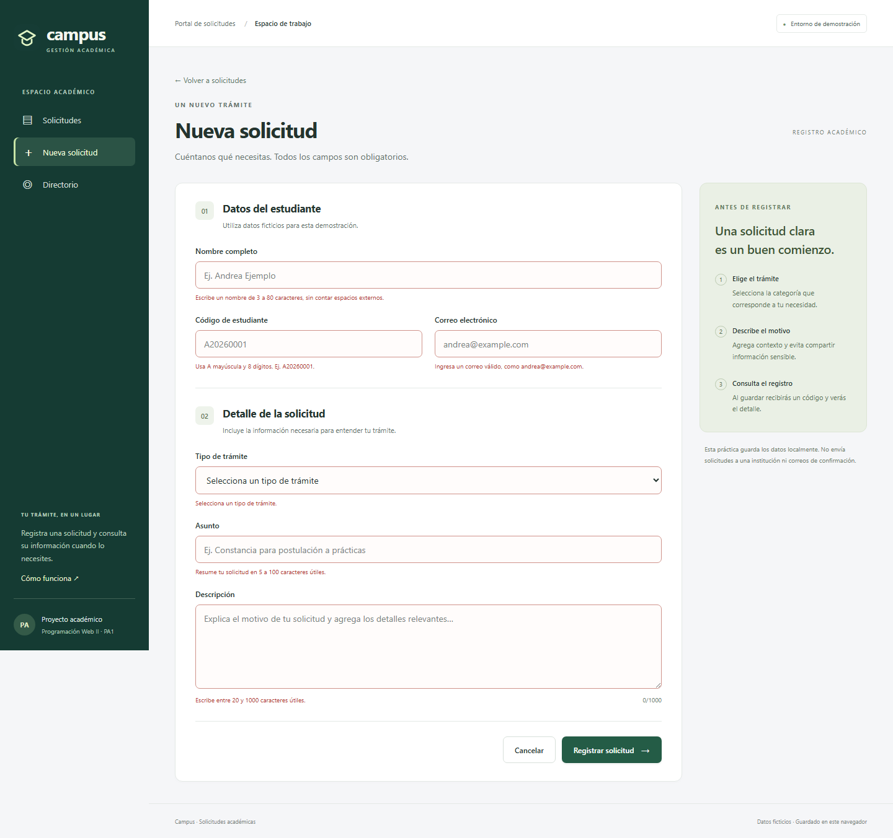
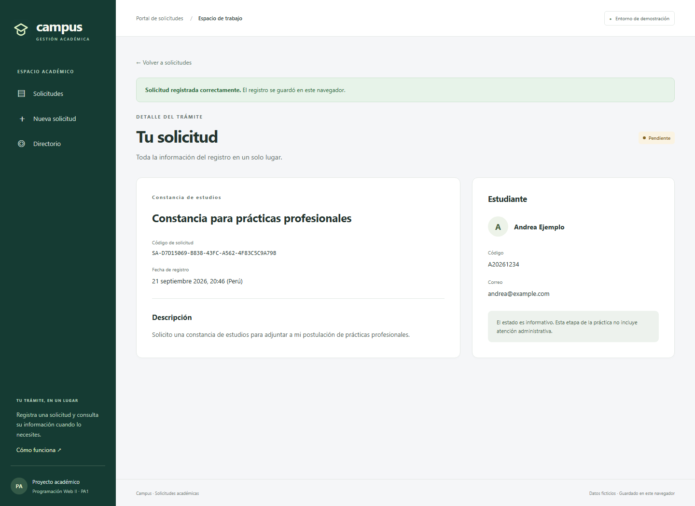
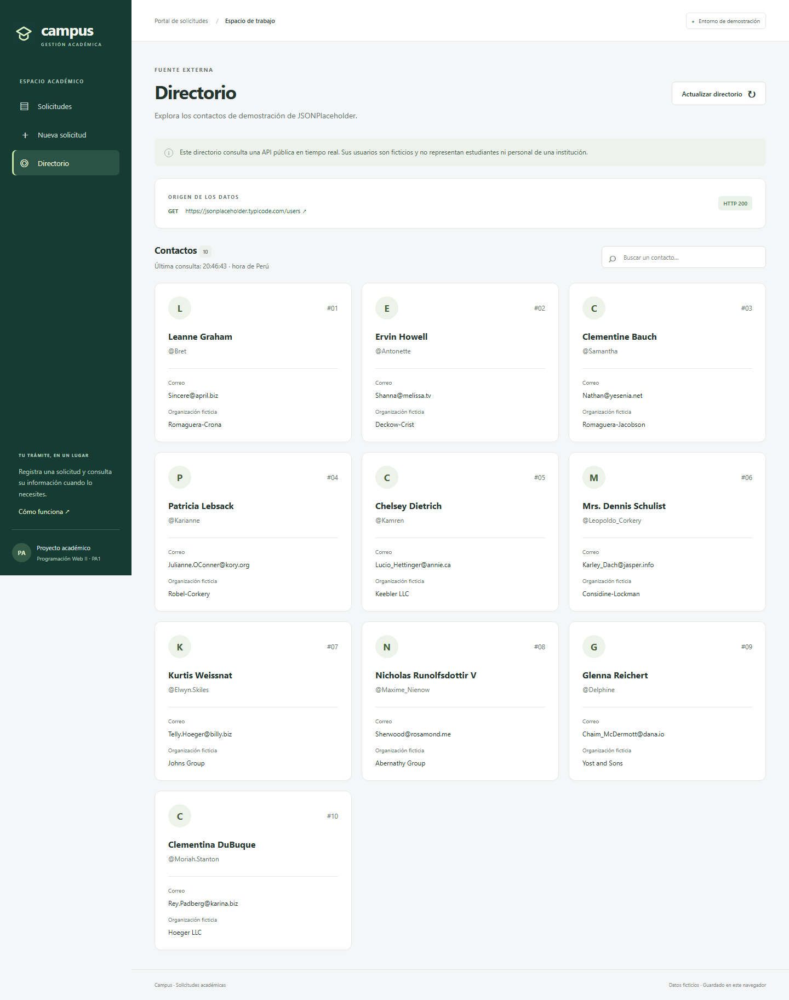
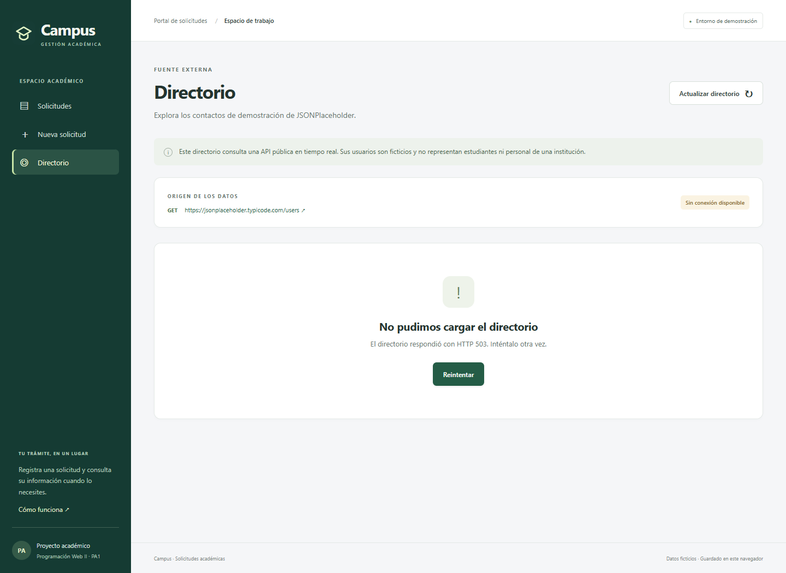
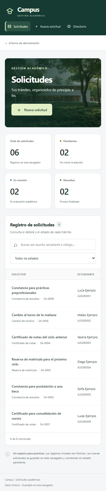

# Evidencias de ejecución

Esta carpeta registra pruebas reales de la aplicación. Los registros académicos y usuarios de la API son ficticios. No contiene evidencia de asistencia ni participación individual en clase.

## Resultado de la verificación

- Compilación de producción de Angular 16: **correcta**.
- Verificación TypeScript: **correcta**.
- Pruebas de navegador: **18 aprobadas, 0 fallidas**.
- Petición real a `https://jsonplaceholder.typicode.com/users`: **GET, HTTP 200, 10 usuarios**.
- Capturas revisadas en escritorio y móvil.

Consultar las fechas exactas en los archivos de resultados. La ejecución usa Node 18.20.8, npm 10.8.2, Angular 16.2.12, CLI 16.2.16, TypeScript 5.1.6 y Playwright 1.56.1. La comprobación final se ejecutó en Microsoft Edge (motor Chromium).

## Archivos

| Evidencia | Descripción |
|---|---|
| [entorno.txt](entorno.txt) | Versiones del entorno de ejecución |
| [tipado.txt](tipado.txt) | Resultado de la comprobación TypeScript |
| [compilacion.txt](compilacion.txt) | Build real, tamaño de salida, fecha y hash |
| [formato.txt](formato.txt) | Verificación de formato del código |
| [pruebas.txt](pruebas.txt) | Resultados de los 18 escenarios de navegador |
| [resultados-pruebas.json](resultados-pruebas.json) | Informe detallado generado por Playwright |
| [consumo-api-real.json](consumo-api-real.json) | Metadatos de la respuesta real obtenida por el navegador |

## Capturas

### 01. Listado, contadores y navegación


### 02. Formulario inválido

Se intenta registrar sin llenar los campos. El formulario muestra errores y no crea un registro.



### 03. Registro correcto

Datos ficticios válidos generan un identificador, estado pendiente y vista de detalle. La prueba también verifica recarga y actualización del contador.



### 04. API real

La prueba marcada **API REAL** no intercepta ni sustituye la respuesta. Espera la petición GET de Angular y comprueba que cada usuario recibido se represente en la vista.



### 05. Error simulado y reintento

La prueba intercepta la petición y devuelve HTTP 503 para verificar el estado de error. Luego responde correctamente al reintentar. **Esta captura es una prueba controlada; no afirma que JSONPlaceholder haya fallado durante la ejecución real.**



### 06. Pantalla móvil

Ancho de 390 píxeles. La tabla permite desplazamiento horizontal dentro de su contenedor; la página completa no se desborda. También se prueba el registro desde este tamaño.



## Integración de imágenes

Capturas adicionales revisadas después de incorporar las imágenes proporcionadas:

- [Formulario ilustrado en escritorio](capturas/07-formulario-ilustrado.png).
- [Formulario ilustrado en móvil](capturas/08-formulario-movil.png).
- [Estado sin solicitudes](capturas/09-lista-vacia.png).

Las tres imágenes cargan correctamente y las vistas comprobadas no presentan desbordamiento horizontal de la página. La compilación y las 18 pruebas se volvieron a ejecutar después de la integración.

## Escenarios comprobados

1. Redirección inicial, seis ejemplos y contadores.
2. Búsqueda sin acentos, filtros combinados y resultados vacíos.
3. Formulario vacío bloqueado con seis errores.
4. Espacios, correo inválido, código incorrecto y longitud mínima.
5. Registro válido, detalle, incremento del resumen y persistencia tras recarga.
6. Navegación atrás, solicitud inexistente y página 404.
7. Cancelación sin guardar.
8. Lectura de almacenamiento corrupto con aviso.
9. Fallo al escribir almacenamiento sin confirmación falsa.
10. Respuesta HTTP controlada correcta y filtro de contactos.
11. HTTP 503 controlado y reintento correcto.
12. JSON inesperado y respuesta vacía.
13. Estado de carga y cancelación al salir de la vista.
14. Consulta externa real con HTTP 200.
15. Navegación y registro móvil sin desbordamiento general.
16. Fallo de red controlado.
17. Entrada con etiquetas HTML mostrada como texto.
18. Lista guardada vacía sin reinserción de ejemplos.

Cada prueba comprueba además que la página no produzca excepciones sin controlar. Las pruebas usan sesiones aisladas y datos ficticios. La disponibilidad futura de JSONPlaceholder puede afectar la prueba real, por eso se separa de las pruebas deterministas en GitHub Actions.

## Reproducción

Desde la raíz y con el entorno del README:

```bash
npm ci
npm run typecheck
npm run build
npx playwright install chromium
npm test
```

La última instrucción regenera el informe JSON y las capturas. Los resultados adjuntos corresponden a las ejecuciones cuyas fechas constan en cada archivo. Una nueva ejecución puede producir fechas y tiempos diferentes; la consulta real también depende de la disponibilidad de JSONPlaceholder.
